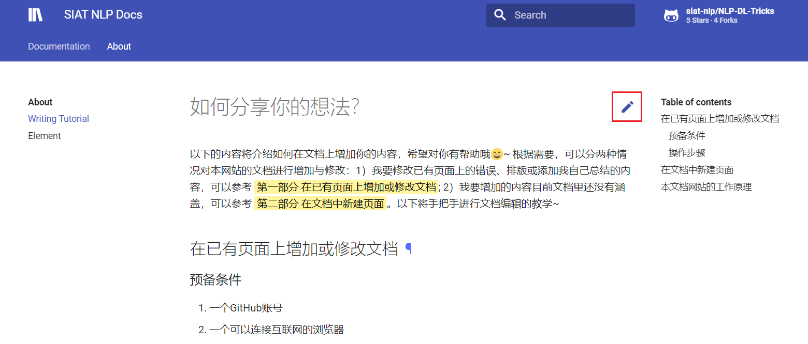
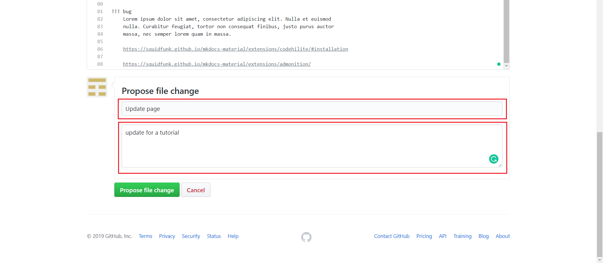
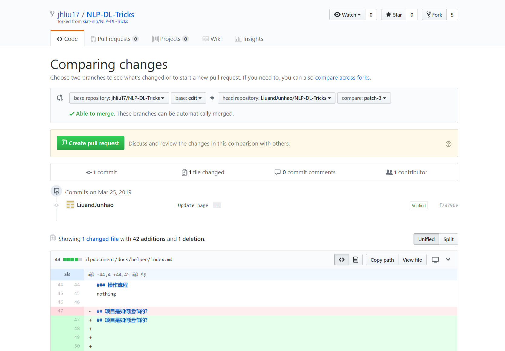
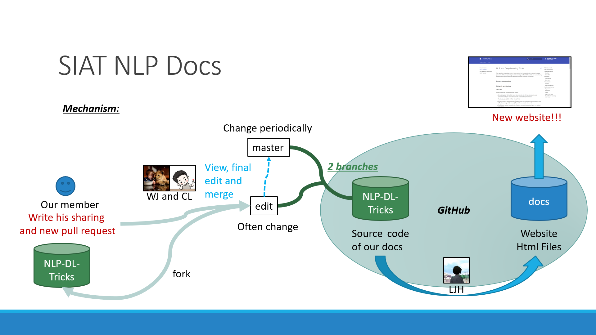

# 如何分享你的想法？
众人拾柴火焰高，为了让本项目的内容能够帮助到更多有需要的NLP研究者与开发者，我们非常欢迎每一个人都积极地贡献自己的知识与力量，让这个项目变得越来越好。本项目提供了简单方便的知识贡献方式，你可以根据以下介绍的内容与步骤来分享你的知识:smile:！

## 在已有页面上增加或修改文档
### 预备条件
1. 一个GitHub账号（若无可以访问[GitHub](https://github.com)进行账号的注册）
2. 一个可以连接互联网的浏览器
   
### 操作流程
访问网站之后，进入到您想要进行更改的页面，可以看到页面的右上方有一个铅笔形状的按钮（比如我想更改About页面下的Writing Tutorial，进入到该页面后可以看到页面上的铅笔按钮， ==如下图红色方框的位置==）。



点击这个铅笔按钮，可以看到我们跳转到了这个页面的md文件（见下图）。本网站使用了mkdocs进行文档的生成， ==因此我们只需编辑对应页面的md文件即可修改对应文档中的内容==。


我们点击上图中红框位置处的铅笔按钮，若提示你没有登录无法点击则需要使用GitHub账号进行登录，登录后即可点击该铅笔状按钮。此时将进入到md文件修改的页面（见下图）。


==进行文件编写时你必须使用md文件支持的markdown语法==，有关markdown的基本语法可以参考前文中的已经存在的代码，相信聪明的你思考片刻就可以进行模仿编写了🤣，如果你需要一些参考资料可以查看[Markdown 语法说明](https://www.appinn.com/markdown/)。

我们做一些简单的更改，在文件末尾添加以下一段代码：
```
!!! bug
    Lorem ipsum dolor sit amet, consectetur adipiscing elit. Nulla et euismod
    nulla. Curabitur feugiat, tortor non consequat finibus, justo purus auctor
    massa, nec semper lorem quam in massa.

    https://squidfunk.github.io/mkdocs-material/extensions/codehilite/#installation

    https://squidfunk.github.io/mkdocs-material/extensions/admonition/
```

它的效果如下：

!!! bug
    Lorem ipsum dolor sit amet, consectetur adipiscing elit. Nulla et euismod
    nulla. Curabitur feugiat, tortor non consequat finibus, justo purus auctor
    massa, nec semper lorem quam in massa.

    https://squidfunk.github.io/mkdocs-material/extensions/codehilite/#installation

    https://squidfunk.github.io/mkdocs-material/extensions/admonition/

可以看到，使用markdown语言可以轻松地编写出美观的文档，点击页面的 **Preview Changes** 可以直接看到修改的结果，方便我们查看是否存在语法错误。值得注意的是， ==本文档还支持markdown拓展功能，可以使用诸如：数学公式、语法高亮，高亮标注等等原生markdown不支持的功能==，有关这一部分的详细内容请参考[Element](element.md)。

当我们修改完成后，需要进行提交修改。滚动页面至底部，可以看到 **Propose file change** ，根据你的修改内容填写对应的描述，如下图所示。



随后点击提交 **Propose file change** ，我们将会进入到最终的提交页面。



在页面下方查看我们的修改无误后，点击 **Create pull request** ，将会把我们的修改内容汇报至文档编辑所在的仓库中。编辑部会进行内容的审核，一旦审核通过你很快就会在网页上看到你的贡献了！为了让我们编写的文档更加统一， ==我们还设定了一些文档的编写范式，帮助我们写出更加统一的文档，可以进入[Writing Paradigm](Writingparadigm.md)进行查看==。

## 项目是如何运作的？
目前内容仓库安排在[NLP-DL-Tricks](https://github.com/siat-nlp/NLP-DL-Tricks)中，当其他用户发起pull request时，将会有仓库拥有者进行整合到edit分支。待准备进行更新后，仓库开发者会对
edit上的代码整合到master分支中，再进行网页的生成与更新。

整个流程的示意图如下：

